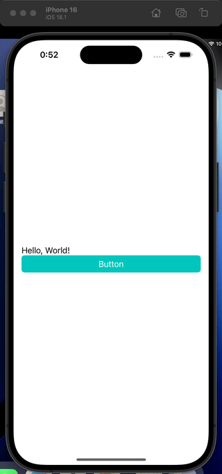
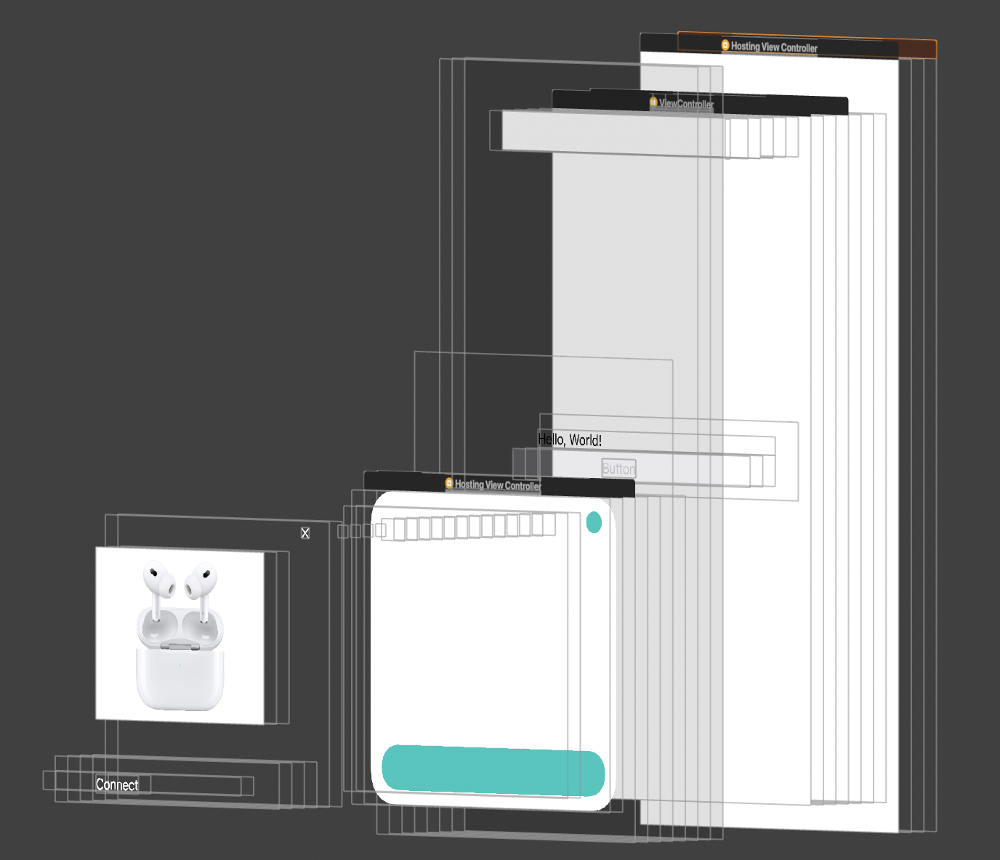

# CardPresentation



```swift
let vc = CardHostingController(rootView: CardContentView())
present(vc, animated: true)
```

# How it work?

`sheetPresentationController` has contentView with margin.



# License

MIT License